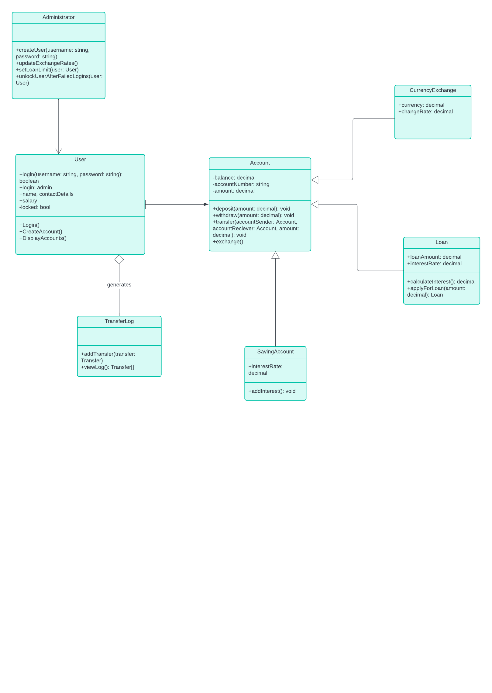

Projektet är en bankapplikation som simulerar en banktjänst med användarhantering, kontohantering och transaktionsloggning. Systemet erbjuder två huvudroller: User (vanlig användare) och Admin (administratör). Användare kan ha flera typer av konton, inklusive Account, SavingAccount och LoanAccount, där de kan göra insättningar, uttag, överföringar och hantera sina transaktioner. Administratörer kan hantera användarkonton, ändra valutakurser och visa alla användares kontoinformation.

Applikationen är designad för att simulera ett interaktivt bankkonto med funktionalitet för att logga in, skapa nya konton, ta lån, betala lån, och överföra pengar mellan användare. Systemet använder en menystruktur för användarinteraktioner och en transaktionslogg för att hålla reda på alla finansiella aktiviteter.
  
1. Admin
Syfte: Representerar en administratör som kan hantera användare och deras konton, samt ändra valutakurser.
Funktioner:
Ändra valutakurser.
Hantera användare (t.ex. ta bort användare, visa alla användare).
Kan visa valutakurslistor.
Har en metod ChangeCur[BankNet.pdf](https://github.com/user-attachments/files/17748831/BankNet.pdf)
rencyRate() för att justera valutakurser.
GetCurrencyDictionary() returnerar en lista över valutakurser som administratören kan manipulera.

2. Account
Syfte: Representerar ett vanligt bankkonto där pengar lagras och transaktioner görs.
Funktioner:
Kan hantera grundläggande funktioner som insättningar, uttag och överföringar.
Håller reda på kontonummer, saldo och valuta.
Loggar transaktioner via TransactionLog (t.ex. när pengar sätts in eller tas ut).
Kan kopplas till en användare som har åtkomst till kontot.

3. SavingAccount
Syfte: En specialversion av Account som representerar ett sparkonto. Har troligen fördelar som högre ränta eller andra funktioner.
Funktioner:
Ärver från Account, vilket innebär att det kan göra samma saker (insättningar, uttag, transaktioner), men har funktioner specifika för sparande.
Till exempel, användaren kan ha möjlighet att sätta in pengar men kanske inte göra uttag lika ofta.
Kan också kopplas till en användare och hanteras via deras User-profil.

4. LoanAccount
Syfte: Representerar ett konto som används för att hantera lån som användare kan ta från banken.
Funktioner:
Håller reda på det lånade beloppet och hur mycket som ska återbetalas.
Kan hantera betalningar på lånet och ge användaren information om hur mycket som återstår att betala.
Kan kopplas till en användare och interagerar med andra konton för att göra avbetalningar eller visa lånets status.

5. IUser (Interface)
Syfte: Ett interface som definierar de grundläggande egenskaperna och funktionerna för alla typer av användare (t.ex. vanliga användare och administratörer).
Funktioner:
Definierar funktioner som alla användartyper måste implementera, t.ex. inloggning, visa kontoinformation, hantera konton och valutafunktioner.
IUser implementeras av både User och Admin, vilket gör att dessa klasser kan behandlas på ett liknande sätt när det gäller användarinteraktioner.

6. User
Syfte: Representerar en vanlig användare som kan ha flera bankkonton (inklusive vanliga konton, sparkonton och lånekonton).
Funktioner:
Kan skapa nya konton, ta lån, hantera sina konton, och se sina transaktioner.
Har metoder för att sätta in och ta ut pengar, överföra pengar till andra användare, visa kontoinformation och historik, etc.
Kan också skapa nya konton (t.ex. SavingAccount eller LoanAccount).
7. TransactionLog

Syfte: Representerar en transaktion som sker på ett konto (t.ex. när pengar sätts in, tas ut eller när en överföring görs).
Funktioner:
Loggar detaljer om transaktionen, inklusive datum, belopp och typ av transaktion.
Används för att skapa historik för varje konto, vilket gör att användaren kan se en lista över sina tidigare transaktioner.
Håller reda på om en transaktion är en insättning, uttag eller överföring och kan visa detaljer om denna transaktion.

8. Menu
Syfte: Representerar en meny med valalternativ för användaren att välja mellan (t.ex. insättning, uttag, överföring).
Funktioner:
Visar en lista över tillgängliga alternativ och hanterar användarens input för att välja vad de vill göra.
MenuRun() är den huvudsakliga metoden som kör menyn och returnerar vilket alternativ användaren valt.
Fungerar som en navigationsstruktur för användare att interagera med applikationens funktioner.'

9. ManageBank
Syfte: Är den centrala klassen som styr applikationen. Den hanterar användarinloggning, interaktion med användare och administratörer samt kontohantering.
Funktioner:
LogIn(): Hanterar inloggning för användare och administratörer genom att be om användarnamn och lösenord, samt verifiera dessa mot lagrade uppgifter.
UserMenu(): Hanterar funktioner som en vanlig användare kan göra efter inloggning, t.ex. att sätta in eller ta ut pengar, skapa nya konton, och göra överföringar.
AdminMenu(): Ger administratören möjlighet att hantera användare, ändra valutakurser, och visa kontoinformation för alla användare.
Loggar ut användaren efter tre misslyckade inloggningsförsök och avslutar programmet.
Hantera konton: Användare kan skapa och hantera konton av olika typer, inklusive vanliga konton och lånekonton.

Relationer mellan klasserna:
ManageBank styr hela applikationen och håller reda på alla användare i form av IUser-objekt. Den hanterar både användar- och administratörsmenyer.
User implementerar IUser och kan ha flera olika typer av konton, inklusive Account, SavingAccount och LoanAccount.
LoanAccount, SavingAccount och Account är alla kontoklasser som representerar olika typer av konton användarna kan ha.
TransactionLog används av alla konton (inklusive LoanAccount och SavingAccount) för att logga transaktioner.
Admin är en särskild typ av IUser som har extra funktioner för att hantera och administrera användare och valutakurser.
Menu används av både User och Admin för att interagera med applikationen och göra val baserat på menyalternativen.
Flöde i applikationen:
ManageBank ansvarar för att initiera applikationen och ge användaren möjlighet att logga in.
Beroende på om användaren är en vanlig User eller en Admin, presenteras olika menyer via Menu.
User kan skapa konton som LoanAccount och SavingAccount och hantera sina konton genom metoder som insättning, uttag, och överföringar.
Alla transaktioner (t.ex. uttag, insättningar, och överföringar) loggas genom TransactionLog.
Admin kan hantera och ta bort användare samt ändra valutakurser genom menyn.

Projektet gjort av Ossy, Tim, Axel, Sami, Joshua
Exemple på användare
AnvändarNamn : User1
lösenord: 1
AnvändarNamn: Admin
Lösenord: 3

First UML draft:

Updated UML

